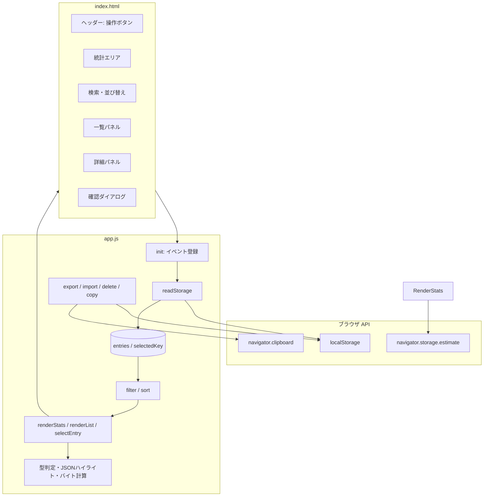
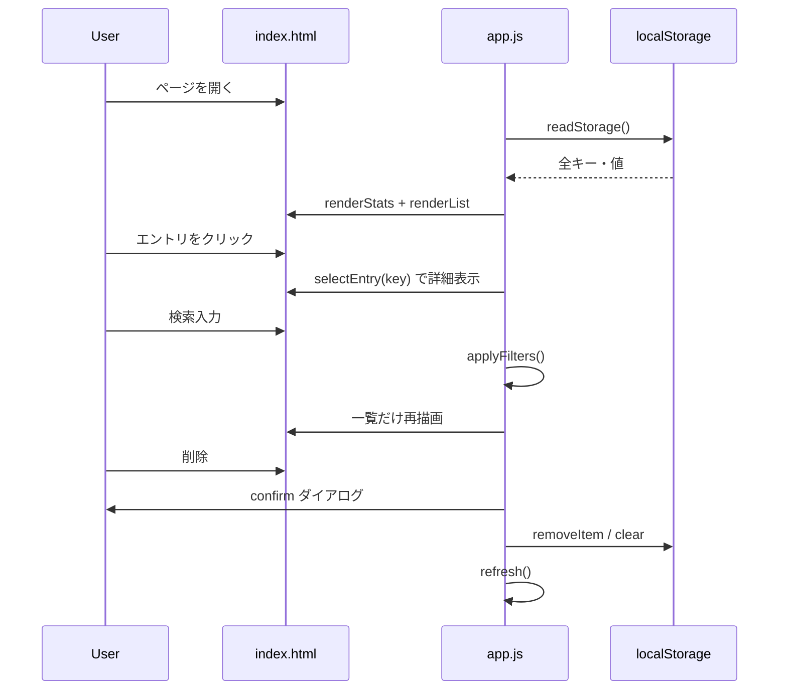

## 全体像

このアプリは **フレームワークなしの静的 Web アプリ** です。ビルドやバンドルはなく、3 ファイルがブラウザでそのまま動きます。

```
localstorage-inspector/
├── index.html   … 画面の骨組み（マークアップ）
├── styles.css   … 見た目
└── app.js       … ロジック（IIFE で1ファイルに集約）
```

ブラウザの **`localStorage` API** を直接読み書きする「インスペクタ」で、サーバー側の処理はありません。

---

## レイヤー構成



| 層 | 役割 |
|---|---|
| **HTML** | 領域の配置と `id` によるフックポイント |
| **CSS** | ダークテーマ、2カラムレイアウト、JSON 色分け |
| **JS** | 読み取り → 加工 → 描画 → 操作の一連の流れ |

---

## `index.html` の UI 構造

画面は大きく **4 ブロック** に分かれています。

1. **ヘッダー** — グローバル操作（更新・エクスポート・インポート・全削除）
2. **統計** (`#stats`) — JS が動的にカードを生成
3. **ツールバー** — 検索入力 + 並び替えセレクト
4. **メイン（2カラム）**
   - **左: 一覧パネル** — エントリリスト、空状態・検索ヒットなしのメッセージ
   - **右: 詳細パネル** — 未選択時はプレースホルダ、選択時はキー・型・整形値・生文字列

加えて、削除確認用の **`<dialog>`** がモーダルとして使われています。トースト通知だけは HTML になく、必要時に JS が `<div class="toast">` を生成します。

---

## `app.js` の内部構造

全体を **即時実行関数 (IIFE)** で包み、グローバル汚染を防いでいます。

### 1. DOM 参照の集約

```6:24:localstorage-inspector/app.js
  const els = {
    origin: $("#origin"),
    stats: $("#stats"),
    search: $("#search"),
    // ...
  };
```

`$()` は `querySelector` の短縮で、よく触る要素を `els` にまとめています。

### 2. アプリ状態（メモリ上のみ）

```26:27:localstorage-inspector/app.js
  let entries = [];
  let selectedKey = null;
```

| 変数 | 意味 |
|---|---|
| `entries` | `localStorage` から読んだ全エントリ `{ key, value, size }[]` |
| `selectedKey` | 詳細パネルで表示中のキー |

React 等の状態管理はなく、この 2 変数が「単一の真実の源」です。

### 3. ユーティリティ層

| 関数 | 役割 |
|---|---|
| `byteSize` / `formatBytes` | キー+値のバイトサイズ計算・表示 |
| `detectType` | 値が string / number / boolean / object / array か推定 |
| `escapeHtml` | XSS 防止 |
| `highlightJson` / `formatDisplayValue` | 詳細パネル用の色付き表示 |

`localStorage` の値は常に **文字列** なので、`detectType` で JSON パースを試みて見た目の型を決めています。

### 4. データ層

```101:113:localstorage-inspector/app.js
  function readStorage() {
    const list = [];
    for (let i = 0; i < localStorage.length; i++) {
      const key = localStorage.key(i);
      const value = localStorage.getItem(key);
      list.push({ key, value, size: byteSize(key) + byteSize(value ?? "") });
    }
    return list;
  }
```

`filterEntries` / `sortEntries` で検索・並び替えを行い、**元データ (`entries`) は変えず**、表示用に派生リストを作ります。

### 5. 描画層

| 関数 | 更新する UI |
|---|---|
| `renderStats` | 上部の統計カード |
| `renderList` | 左の一覧（毎回 `innerHTML` で再構築） |
| `selectEntry` | 右の詳細パネル |
| `clearDetail` | 選択解除 |

描画の中心フローは次のとおりです。

```
refresh() → readStorage() → entries 更新 → renderStats()
         → applyFilters() → filter + sort → renderList()
```

検索や並び替えの入力は `applyFilters()` だけを呼び、毎回 `refresh()` までは戻しません。

### 6. 操作層（副作用あり）

| 関数 | 動作 |
|---|---|
| `exportJson` | `entries` を JSON ファイルとしてダウンロード |
| `importJson` | ファイル読み込み → `localStorage.setItem` → `refresh()` |
| `deleteKey` / `clearAll` | 確認ダイアログ後に削除 → `refresh()` |
| `copyText` | Clipboard API でコピー |

破壊的操作はすべて `confirm()`（`<dialog>`）で確認してから実行します。

### 7. 初期化

```370:404:localstorage-inspector/app.js
  function init() {
    els.origin.textContent = location.origin;
    // 各ボタン・入力にイベントリスナー登録
    refresh();
  }
  init();
```

起動時にイベントを結び、最後に `refresh()` で初回描画します。

---

## データの流れ（ユーザー操作）



---

## `styles.css` の役割

- **CSS 変数** (`:root`) でダークテーマの色を一元管理
- **Grid** (`.layout`) で一覧・詳細の 2 カラム（768px 以下で 1 カラム）
- **`.json-*` クラス** — `app.js` が生成する HTML に色を当てる
- **`.toast`** — JS が動的に追加する通知用

ロジックとスタイルは完全に分離され、クラス名だけで結合しています。

---

## 設計上の特徴・制約

**シンプルさ優先**
- モジュール分割・npm 依存なし
- 一覧は仮想スクロールなし（件数が少ない前提で毎回 DOM 再生成）

**オリジン制約**
- `localStorage` は同一オリジン専用のため、`http://localhost:8765` で開けば **そのオリジンのデータだけ** が見えます。他サイトのデータは DevTools からは見えても、このページ単体では見えません。

**セキュリティ**
- 一覧・詳細の表示前に `escapeHtml` でエスケープ
- JSON ハイライト時のみ、制御した `<span>` を `innerHTML` で挿入

---

まとめると、**HTML が画面の器、CSS が見た目、`app.js` が「読む → フィルタ → 描画 → 書き換え」のサイクルを一手に担う**、典型的なバニラ JS の小さなツール構成です。特定の部分（例: `highlightJson` の正規表現や `confirm` の Promise 化）を深掘りしたい場合は、知りたい箇所を指定してください。
